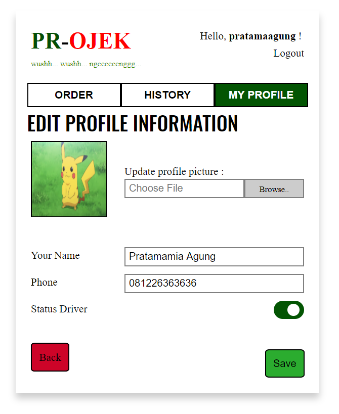

# `Project Cheetos` :tiger: : PR-Ojek Web Application 
##### IF3110 Penegembangan Aplikasi Berbasis Web
---
## Background
Seperti kita ketahui, kemacetan merupakan salah satu _problem_ utama yang dihadapi oleh masyarakat Indonesia setiap harinya, terutama bagi beberapa kota besar. Beberapa survei telah mengkonfirmasi seberapa parah dampak dari masalah kemacetan ini bagi produktivitas masyarakat itu sendiri. Pada tahun 2015, Castrol Magnatec Stop-Start Index menyatakan bahwa dalam setahun rata-rata pengendara di Jakarta mengalami berhenti-jalan sebanyak 33.240 kali. Dari survei ini juga terungkap rata-rata pengemudi di Jakarta harus mengalami terjebak macet 27,22% dari total waktu perjalanan semestinya. Hal ini tentu akan cukup berdampak terhadap rutinitas masyarakat, seperti yang dikiaskan beberapa orang sebagai "menghabiskan hidup di jalan".   

Salah satu solusi untuk mengatasi kemacetan tersebut adalah dengan penggunaan kendaraan umum sebagai sarana transportasi. **PR-Ojek** adalah suatu aplikasi web yang dapat digunakan untuk memesan Ojek. Aplikasi ini dikembangkan sebagai salah satu usaha untuk mendekatkan penggunaan kendaraan umum kepada masyarakat. Dengan dikembangkannya aplikasi ini, diharapkan dapat membantu menyelesaikan masalah kemacetan di Indonesia.
## Features
Beberapa fitur yang didukung oleh aplikasi **PR-Ojek** ini adalah sebagai berikut:
* Pendaftaran user secara public (*anyone, anywhere, anytime*)
* Menampilkan dan merubah profil pengguna
* Preferred location (*driver only*)
* Pemesanan ojek
* History pemesanan ojek

## MockUps View
Berikut adalah beberapa tampilan antarmuka yang ada pada aplikasi web **PR-Ojek** 
#### Sign Up
Digunakan saat pengguna ingin mendaftarkan akun baru.

#### Login
Digunakan oleh pengguna yang telah memiliki akun untuk masuk ke dalam aplikasi.

#### Profile
Untuk melihat profil pengguna. Informasi yang ditampilkan di antaranya *username*, nama, *email*, nomor telepon, dan informasi mengenai *driver*.

#### Edit Profile
Digunakan untuk merubah data pengguna. Data yang dapat diubah yaitu nama, nomor telefon, avatar, dan status sebagai driver.

#### Edit Preferred Location
Digunakan untuk mengedit lokasi yang dipilih oleh pengguna sebagai seorang driver. Pada halaman ini, pengguna dapat menambah, menghapus, maupun mengubah urutan preferensi yang diharapkan.

#### Make Order
Pada halaman ini, pengguna dapat memesan ojek dengan memilih lokasi penjemputan dan tujuan perjalanan. Pengguna juga dapat memilih *driver* yang diinginkan (jika tersedia).

#### Select Driver
Setelah melakukan data lokasi perjalanan, pengguna dapat memilih *driver-driver* yang dapat mengantarkannya.

#### Complete Order
Digunakan untuk menyelesaikan proses perjalanan dengan *driver* **PR-Ojek**. Pengguna dapat memasukkan *rating* dan komentar atas pengalaman perjalanannya.

#### Transaction History
Merupakan halaman yang menampilkan pemesanan yang telah dilakukan oleh pengguna selama ini. Pegguna dapat menyembunyikan *history* transaksi yang tidak ingin ditampilkan.

#### Driver History
Halaman ini menampilkan semua *order* yang telah diterima sebagai seorang *driver* **PR-Ojek**.

## Setup
1. Edit setup database pada `setup.php`, masukan informasi database, meliputi hostname (defaultnya localhost), username (defaultnya root), dan password(defaultnya kosong)
2. Edit `dbconn_sample.php` -> `dbconn.php`, dan edit setup database pada file tersebut seperti pada `setup.php`
3. Jalankan `setup.php`. ex `localhost/setup.php`
4. Buat folder uploads, dengan owner `www-data:www-data` dan permission `775`

## Jobs Description
Pembagian tugas dalam pengembangan aplikasi ini adalah sebagai berikut:
#### View
No | Job | Person in Charge
--- | ------------- | --------------
1 | Login | 13515109
2 | Sign up | 13515109 
3 | Order | 13515142
4 | History | 13515142
5 | Profile | 13515097
6 | Edit Profile | 13515097
7 | Edit Prefferded Location | 13515097

#### Functionality
No | Job | Person in Charge
--- | ------------- | --------------
1 | Login Controller | 13515097
2 | Signup Controller  | 13515142, 13515097
3 | Profile Controller | 13515097
4 | Ajax Get Post | 13515142
5 | User Helper | 13515097
6 | Location Helper | 13515097
7 | Delete Preferred Location | 13515097
8 | Edit Preferred Location | 13515097
9 | Show Profile | 13515097
10 | Hide History | 13515142
11 | Show History |13515142
12 | Get Driver List (order) | 13515109
13 | Make Order | 13515109
14 | Form validation | 13515142

## Our Members

